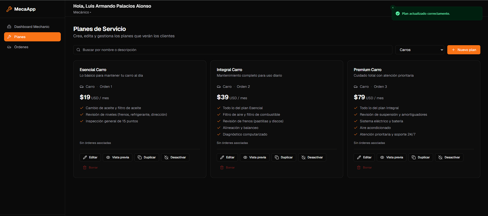

# MecaApp 🛠️🇻🇪

Plataforma Web Progresiva (**PWA Mobile-First**) que conecta a propietarios de vehículos (carros y motos) con mecánicos independientes y talleres especializados en Venezuela.

Es un **panel de control automotriz** en modo oscuro: los clientes gestionan sus vehículos y solicitan planes de mantenimiento a mecánicos, y los administradores controlan el catálogo de planes y los roles de la plataforma.


| Panel de Configuración (Desktop)                          |
| :-------------------------------------------------------: |
|               |
| _Vista ampliada para gestión de perfil y taller_         |

---

## 📑 Tabla de contenidos

1. [Características](#-características)
2. [Stack](#-stack)
3. [Arquitectura](#-arquitectura)
4. [Requisitos previos](#-requisitos-previos)
5. [Instalación local](#-instalación-local)
6. [Scripts disponibles](#-scripts-disponibles)
7. [Variables de entorno](#-variables-de-entorno)
8. [Alta de un cliente nuevo (multi-instancia)](#-alta-de-un-cliente-nuevo-multi-instancia)

---

## ✨ Características

- **Autenticación con roles** — registro/login por correo con confirmación y sesiones SSR por cookies. Tres roles: cliente, mecánico y administrador, cada uno con su propio panel y rutas protegidas por layout.
- **Gestión de Vehículos para Clientes** — registro del garaje personal (marca, modelo, año, placa) con clasificación carro/moto antes de solicitar un servicio.
- **Catálogo de Planes** — los administradores crean, editan, destacan, activan y duplican los planes que ven los clientes según el tipo de vehículo.
- **Solicitud de Servicio** — el cliente elige mecánico, vehículo y plan; el precio queda congelado (snapshot) en la orden, de modo que editar o eliminar un plan no altera órdenes existentes.
- **Flujo de Órdenes del Mecánico** — transiciones validadas de estado: pendiente → aceptada → en progreso → completada (o cancelada en cualquier punto). Las órdenes en curso viven en su propia vista **Órdenes Activas**, donde el mecánico trabaja el checklist y desde donde se le redirige al iniciar un servicio.
- **Checklist de Avance** — cada orden nace con los puntos del plan como pasos; el mecánico añade, quita y marca puntos según avanza el trabajo, y el cliente ve el progreso (X/N con horarios) en "Mis Órdenes".
- **Roles y Permisos** — el administrador propietario promueve y degrada administradores; los administradores gestionan mecánicos y usuarios desde el gestor de usuarios.
- **Seguridad nativa (RLS)** — protección de datos en PostgreSQL: cada usuario solo accede a lo que le pertenece, la escalada de privilegios está bloqueada por triggers, y la validación de órdenes ocurre en la base de datos, no solo en el código.

---

## 🛠️ Stack

| Herramienta          | Rol                                                                           |
| -------------------- | ----------------------------------------------------------------------------- |
| **Next.js 16**       | Framework React con App Router, SSR y Server Actions (Turbopack)              |
| **Tailwind CSS 3.4** | Estilos atómicos y tokens de diseño personalizados (`tailwind.config.ts`)     |
| **Shadcn (NextJS)**  | Librería de componentes accesibles para UI (_Cards, Chips, Switches, Modals_) |
| **Supabase**         | Backend-as-a-Service (PostgreSQL, Supabase Auth y Row Level Security)         |
| **TypeScript**       | Tipado estricto en toda la aplicación y esquemas de base de datos             |
| **Lucide React**     | Conjunto de íconos                                                             |

---

## 🏗️ Arquitectura

- **Solo App Router.** Las páginas del dashboard fuerzan renderizado dinámico (`await connection()`), y las mutaciones viven en Server Actions que re-verifican el rol.
- **Lecturas de datos centralizadas** en `lib/supabase/helpers.ts` (memoizadas con `React.cache` por request); prefíerelas sobre consultas ad-hoc.
- **Sesiones SSR por cookies de Supabase:** `lib/supabase/server.ts` (servidor), `lib/supabase/client.ts` (navegador) y `lib/supabase/proxy.ts` (`updateSession`, invocado desde `proxy.ts` en la raíz — el middleware de Next 16).
- **Roles (`user | mechanic | admin`)** aplicados en dos capas: `requireRole(...)` en los layouts de `app/dashboard/{client,mechanic,admin}` y políticas RLS + triggers de validación en la base de datos.
- **Esquema de BD idempotente:** `supabase-schema.sql` en la raíz del repo se aplica manualmente en el SQL Editor de Supabase; incluye tablas, índices, políticas RLS y triggers (`handle_new_user` crea el perfil, `prevent_profile_privilege_escalation` bloquea escaladas, `validate_order` valida cada orden al insertar).
- **Catálogo de planes:** la tabla `plans` es la fuente de verdad; las `orders` guardan un snapshot de `plan_id`/`plan_name`/`plan_price_usd` para inmunidad frente a ediciones del catálogo.

---

## ✅ Requisitos previos

- **Node.js ≥ 20**
- **pnpm** (gestor de paquetes del proyecto)
- Un **proyecto Supabase** propio (gratuito en [supabase.com](https://supabase.com)) con el esquema aplicado (ver instalación local)
- Opcional: cuenta de **Vercel** para despliegue

---

## 💻 Instalación local

```bash
# 1. Clonar e instalar dependencias
git clone <url-del-repo>
cd mecaapp
pnpm install

# 2. Crear .env.local con las variables (ver tabla siguiente)
#    En Windows: New-Item .env.local   |   En macOS/Linux: touch .env.local

# 3. Aplicar el esquema de base de datos
#    Copia el contenido de supabase-schema.sql y ejecútalo en el
#    SQL Editor de tu proyecto Supabase (es idempotente: puede
#    ejecutarse varias veces sin duplicar nada).

# 4. Levantar el servidor de desarrollo
pnpm dev
```

Abre <http://localhost:3000>. Regístrate con el correo que definiste como `OWNER_EMAIL` y tu cuenta quedará promovida a administrador automáticamente.

---

## 📜 Scripts disponibles

| Comando         | Descripción                                                        |
| --------------- | ------------------------------------------------------------------ |
| `pnpm dev`      | Servidor de desarrollo (Next.js + Turbopack)                        |
| `pnpm build`    | Compilación de producción (también verifica los tipos de TypeScript) |
| `pnpm start`    | Sirve la compilación de producción                                  |
| `pnpm lint`     | ESLint sobre todo el repo (sin autofix)                             |
| `pnpm analyze`  | Compilación con analizador de bundle (`@next/bundle-analyzer`)      |

> **Nota:** no hay suite de tests; los cambios se verifican con `pnpm lint` y `pnpm build`.

---

## ⚙️ Variables de entorno

Cada instancia (cliente/empresa) se despliega con el mismo código y **un único archivo `.env`** (nunca versionado; en local se llama `.env.local`):

| Variable                                | Requerido | Descripción                                                          |
| --------------------------------------- | --------- | -------------------------------------------------------------------- |
| `NEXT_PUBLIC_SUPABASE_URL`              | Sí        | URL del proyecto Supabase **propio** de ese cliente.                 |
| `NEXT_PUBLIC_SUPABASE_PUBLISHABLE_KEY`  | Sí        | Clave pública (publishable) de ese proyecto.                         |
| `SUPABASE_SERVICE_ROLE_KEY`             | Sí        | Secreto del servidor para asignar roles (nunca exponer al cliente).  |
| `OWNER_EMAIL`                           | Sí        | Correo global/propietario: se promueve a admin al registrarse.       |
| `NEXT_PUBLIC_SITE_URL`                  | No        | Origen para redirecciones de auth (en Vercel se deriva automáticamente). |

**Modelo de roles:** el `OWNER_EMAIL` es el único rol definido por configuración. Ese correo inicia sesión, y desde **Usuarios** promueve administradores y mecánicos con sus correos propios; una vez promovidos, funcionan con su correo sin depender del global. Solo el propietario puede crear/degradar administradores.

---

## 🚀 Alta de un cliente nuevo (multi-instancia)

Modelo SaaS: **un proyecto Supabase + un archivo `.env` por cliente**, todos desplegando el mismo código.

1. Crear un **proyecto Supabase** nuevo para el cliente y aplicar `supabase-schema.sql` en el SQL Editor.
2. Crear un **proyecto de hosting** (p. ej., Vercel) apuntando al mismo repositorio/rama base.
3. Configurar las 4 variables requeridas en los secrets del despliegue (más `NEXT_PUBLIC_SITE_URL` si el dominio es personalizado).
4. Entregar al cliente su `OWNER_EMAIL`: al registrarse quedará como administrador automáticamente.
5. El cliente promueve a su equipo (administradores y mecánicos) desde el panel de Usuarios.

---

## 📄 Licencia

Uso privado. Todos los derechos reservados.
